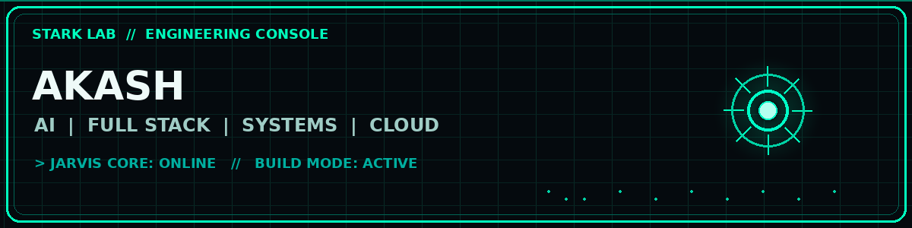


<div align="center">



# AKASH

### AI | FULL STACK | SYSTEMS | BUILDER

Building intelligent software, production-oriented web applications and experimental systems.

<br>

<a href="https://github.com/tejaakashmalla-cmyk">

</a>
<a href="https://tejaakashmalla-cmyk.github.io/portfolio/">

</a>

<br><br>


</div>

---

# JARVIS CORE

```text
+----------------------------------------------------------------+
|                    JARVIS CORE // ONLINE                      |
+----------------------------------------------------------------+
|                                                                |
|  OPERATOR       AKASH                                          |
|  ROLE           B.Tech IT Engineer                             |
|  PRIMARY        Full-Stack Engineering                         |
|  SECONDARY      AI / Automation / Systems                      |
|  CURRENT MODE   BUILD                                          |
|  STATUS         [ ONLINE ]                                     |
|                                                                |
|  SYSTEM OBJECTIVE:                                             |
|  Turn ideas into useful software.                              |
|                                                                |
|  "Sometimes you gotta run before you can walk."               |
|                                      - Tony Stark              |
|                                                                |
+----------------------------------------------------------------+
<div align="center">

### SYSTEM TELEMETRY

| CORE | STATUS | MODE | FOCUS |
|:---:|:---:|:---:|:---:|
| JARVIS | 🟢 ONLINE | BUILD | AI |
| API | 🟢 READY | DEVELOPMENT | FULL STACK |
| CLOUD | 🟢 ACTIVE | DEPLOYMENT | SYSTEMS |
| LAB | 🟢 RUNNING | EXPERIMENTAL | AUTOMATION |

</div>
---

<div align="center">

## // MISSION CONTROL

```text
┌──────────────────────────────────────────────────────────────┐
│                     JARVIS COMMAND CENTER                    │
├──────────────────────────────────────────────────────────────┤
│                                                              │
│  [01] AI SYSTEMS              ████████████████████  ONLINE   │
│  [02] FULL STACK              ███████████████████░  ACTIVE   │
│  [03] CLOUD INFRA              █████████████████░░  READY    │
│  [04] AUTOMATION               ██████████████████░  BUILD    │
│  [05] EXPERIMENTAL LAB         ███████████████████  RUNNING  │
│                                                              │
│  CORE TEMPERATURE       37°C                                 │
│  ACTIVE PROJECTS        05                                   │
│  SYSTEM MODE            BUILD                                │
│  JARVIS STATUS          ONLINE                               │
│                                                              │
└──────────────────────────────────────────────────────────────┘
---

# PROJECT COMMAND CENTER

<table>
<tr>
<td width="50%">

### SIGNALDESK
**Real-Time Incident Command Center**

```text
STATUS   :: ACTIVE
DOMAIN   :: SRE / DEVOPS
STACK    :: REACT / NODE / WEBSOCKET
MODE     :: INCIDENT RESPONSE
---

# JARVIS TERMINAL

```text
AKASH@STARK-LAB:~$ systemctl status jarvis

● jarvis-core.service
   Loaded: loaded
   Active: active (running)

   AI ENGINE        [████████████████████] 100%
   FULL STACK       [███████████████████░]  96%
   SYSTEMS          [██████████████████░░]  92%
   CLOUD            [█████████████████░░░]  88%

   STATUS: ONLINE
   AKASH@STARK-LAB:~$ ./build --mode production

> initializing architecture...
> loading intelligence modules...
> connecting services...
> compiling systems...
> deployment pipeline ready...

BUILD STATUS :: SUCCESS

---

# 6. Add your engineering philosophy

```markdown
---

# ENGINEERING PROTOCOL

```text
01  BUILD BEFORE TALKING
02  AUTOMATE WHAT REPEATS
03  DESIGN FOR FAILURE
04  OBSERVE EVERYTHING
05  KEEP SYSTEMS SIMPLE
06  SHIP. MEASURE. IMPROVE.
07  LEARN SOMETHING EVERY DAY.