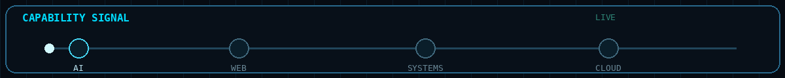
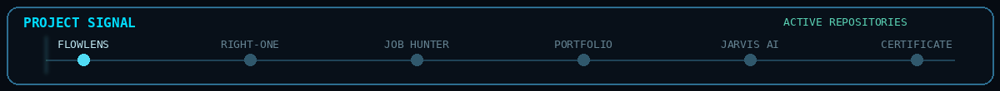
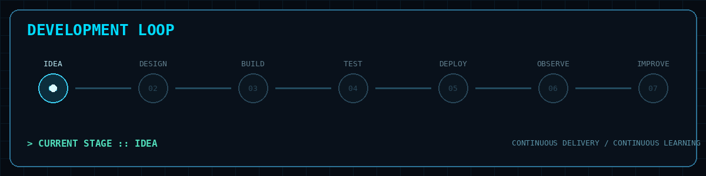
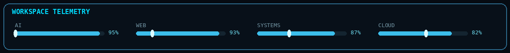



AKASH
AI • FULL STACK • SYSTEMS • BUILDER
Building intelligent software, production-oriented applications and experimental systems.

ENGINEERING IDENTITY

BUILDING SOFTWARE AT THE INTERSECTION OF AI, WEB AND SYSTEMS

<table>
<tr>
<td width="58%" valign="top">

WHO I AM
I am a B.Tech IT engineer focused on turning ideas into working software.
I enjoy building across the stack — from interfaces and APIs to databases, cloud deployment and intelligent systems.
</td>

<td width="42%" valign="top">

ENGINEERING MODE
+--------------------------+
|   ENGINEERING STATUS     |
+--------------------------+
|                          |
|  SYSTEM       ONLINE     |
|  BUILD        ACTIVE     |
|  AI           ENABLED    |
|  FULL STACK   ACTIVE     |
|  CLOUD        BUILDING   |
|  STATUS       READY      |
|                          |
+--------------------------+
</td>
</tr>
</table>

CAPABILITY MATRIX
<table>
<tr>
<th>DOMAIN</th>
<th>CAPABILITY</th>
<th>MODE</th>
</tr>

<tr>
<td><b>AI ENGINEERING</b></td>
<td>RAG, LLM applications, automation and voice AI</td>
<td>ACTIVE</td>
</tr>

<tr>
<td><b>FULL STACK</b></td>
<td>React, Next.js, Node.js, FastAPI and complete web systems</td>
<td>ACTIVE</td>
</tr>

<tr>
<td><b>BACKEND</b></td>
<td>REST APIs, WebSockets, authentication and service architecture</td>
<td>ACTIVE</td>
</tr>

<tr>
<td><b>DATA</b></td>
<td>MongoDB, PostgreSQL, SQLite and vector-oriented systems</td>
<td>BUILD</td>
</tr>

<tr>
<td><b>CLOUD</b></td>
<td>Application deployment, configuration and hosted services</td>
<td>BUILD</td>
</tr>

<tr>
<td><b>DEVOPS</b></td>
<td>Observability, incident workflows and engineering operations</td>
<td>EXPLORING</td>
</tr>

<tr>
<td><b>MOBILE</b></td>
<td>Flutter applications and AI-assisted mobile experiences</td>
<td>EXPERIMENTAL</td>
</tr>

</table>

\n\n\n\n
\n\n---\n\n# TECH STACK

LANGUAGES

FRONTEND

BACKEND

DATABASES

TOOLS & CLOUD

ENGINEERING LEVEL
AI ENGINEERING

RAG / LLM               ███████████████░░░░░   ACTIVE
AI AUTOMATION           ███████████████░░░░░   ACTIVE
VOICE AI                █████████████░░░░░░░   BUILD

FULL STACK

REACT                   ██████████████████░░   ACTIVE
NODE.JS                 █████████████████░░░   ACTIVE
APIs                    ██████████████████░░   ACTIVE
DATABASES               ███████████████░░░░░   BUILD

SYSTEMS

GIT / GITHUB            ████████████████████   ACTIVE
WEBSOCKETS              ███████████████░░░░░   BUILD
CLOUD DEPLOYMENT        ███████████████░░░░░   BUILD
OBSERVABILITY            ████████████░░░░░░░░   EXPLORING
PROJECT ARCHITECTURE
                         IDEAS
                           |
                           v
                    +-------------+
                    |   DESIGN    |
                    +------+------+
                           |
                           v
                    +-------------+
                    |    BUILD    |
                    +------+------+
                           |
                           v
                    +-------------+
                    |    TEST     |
                    +------+------+
                           |
                           v
                    +-------------+
                    |   DEPLOY    |
                    +------+------+
                           |
                           v
                    +-------------+
                    |   OBSERVE   |
                    +------+------+
                           |
                           v
                    +-------------+
                    |   IMPROVE   |
                    +------+------+
                           |
                           +-----------> REPEAT

\n\n\n\n
\n\n---\n\n# SELECTED BUILDS

REAL PROJECTS • REAL SYSTEMS • REAL EXPERIMENTS

<table>
<tr>

<td width="33%" valign="top">

FLOWLENS
AI Software Architecture Intelligence
CODEBASE
   |
   v
ANALYSIS
   |
   v
DEPENDENCIES
   |
   v
ARCHITECTURE
   |
   v
VISUAL INSIGHT
Codebase analysis and architecture intelligence platform.

</td>

<td width="33%" valign="top">

RIGHT-ONE
Product Price Intelligence
SEARCH
   |
   v
COMPARE
   |
   v
FILTER
   |
   v
BEST OPTION
A product comparison application for finding and comparing purchasing options.

</td>

<td width="33%" valign="top">

JOB HUNTER
Job Discovery Application
DISCOVER
   |
   v
SEARCH
   |
   v
FILTER
   |
   v
APPLY
A job discovery application focused on helping users explore relevant opportunities.

</td>

</tr>

<tr>

<td width="33%" valign="top">

PORTFOLIO
Personal Developer Platform
DESIGN
   |
   v
IDENTITY
   |
   v
PROJECTS
   |
   v
PRESENCE
Personal engineering portfolio and professional web presence.

</td>

<td width="33%" valign="top">

JARVIS AI
AI Assistant Experiment
INPUT
  |
  v
UNDERSTAND
  |
  v
PROCESS
  |
  v
RESPOND
An experimental AI assistant system exploring intelligent interaction and automation.

</td>

<td width="33%" valign="top">

CERTIFICATE GENERATOR
Document Automation Tool
INPUT
  |
  v
TEMPLATE
  |
  v
GENERATE
  |
  v
EXPORT
A utility focused on generating certificates through an automated workflow.

</td>

</tr>
</table>

MORE SYSTEMS I HAVE BUILT
<table>
<tr>
<td width="50%" valign="top">

SIGNALDESK
Real-time incident command center for service health, incidents, telemetry and engineering workflows.
Stack: React • Node.js • WebSockets
</td>

<td width="50%" valign="top">

DOCUTRUST
Document intelligence and RAG platform built around document processing, retrieval and AI interaction.
Stack: React • FastAPI • Chroma
</td>
</tr>

<tr>
<td width="50%" valign="top">

WAKEVOICE
Experimental voice-based alarm application with voice profiles, alarm scheduling and AI-generated messages.
Stack: Flutter • FastAPI • Voice AI
</td>

<td width="50%" valign="top">

ECHOSHIFT
Two-timeline 2D action platformer using timeline switching, combat and enemy AI.
Stack: JavaScript • Phaser
</td>
</tr>

<tr>
<td width="50%" valign="top">

SCHOLARSHIP INFORMATION PORTAL
Student-focused scholarship discovery platform.
Stack: React • Node.js • MongoDB
</td>

<td width="50%" valign="top">

EXPERIMENTAL LAB
A growing collection of prototypes, utilities and technical experiments used to explore new ideas quickly.
Mode: BUILD • TEST • LEARN
</td>
</tr>
</table>

\n\n\n\n
\n\n---\n\n# CURRENT WORKSPACE

+--------------------------------------------------------------+
|                     CURRENT OPERATIONS                       |
+--------------------------------------------------------------+
|                                                              |
|  [01] AI APPLICATIONS                         ACTIVE         |
|  [02] FULL-STACK SYSTEMS                     ACTIVE         |
|  [03] RAG / LLM EXPERIMENTS                  ACTIVE         |
|  [04] CLOUD DEPLOYMENT                       BUILD          |
|  [05] DEVOPS / OBSERVABILITY                 BUILD          |
|  [06] AUTOMATION                             EXPLORING      |
|                                                              |
+--------------------------------------------------------------+
ENGINEERING WORKFLOW
IDEA
  |
  +--> ARCHITECT
          |
          +--> CODE
                 |
                 +--> TEST
                        |
                        +--> DEPLOY
                               |
                               +--> MONITOR
                                      |
                                      +--> ITERATE
ENGINEERING PRINCIPLES
<table>
<tr>
<td align="center">

BUILD
Turn ideas into working systems.
</td>

<td align="center">

UNDERSTAND
Know what happens behind the interface.
</td>

<td align="center">

AUTOMATE
Remove repetitive engineering work.
</td>
</tr>

<tr>
<td align="center">

OBSERVE
Measure system behavior.
</td>

<td align="center">

IMPROVE
Iterate continuously.
</td>

<td align="center">

SHIP
Deliver useful software.
</td>
</tr>
</table>

ENGINEERING SIGNAL
[AI]          RAG / LLM / AUTOMATION
[WEB]         REACT / NEXT.JS / TYPESCRIPT
[SERVER]      NODE.JS / EXPRESS / FASTAPI
[DATA]        MONGODB / POSTGRESQL / SQLITE
[REALTIME]    WEBSOCKETS
[CLOUD]       VERCEL / RENDER
[TOOLS]       GIT / GITHUB / VSCODE
[MOBILE]      FLUTTER
DEVELOPMENT STATUS
[BOOT]      Development environment initialized
[LOAD]      Full-stack modules loaded
[LOAD]      AI modules loaded
[LOAD]      Database systems ready
[LOAD]      Cloud environment ready
[SYNC]      Git repositories synchronized
[BUILD]     Project workspace active
[STATUS]    Engineering mode enabled

SYSTEM STATUS :: ONLINE
GITHUB

CONNECT

Building. Experimenting. Shipping.

ENGINEERING SYSTEM STATUS
SYSTEM      ONLINE
AI          ENABLED
FULL STACK  ACTIVE
CLOUD       BUILDING
AUTOMATION  EXPLORING
STATUS      READY

BUILD • DEPLOY • OBSERVE • IMPROVE

