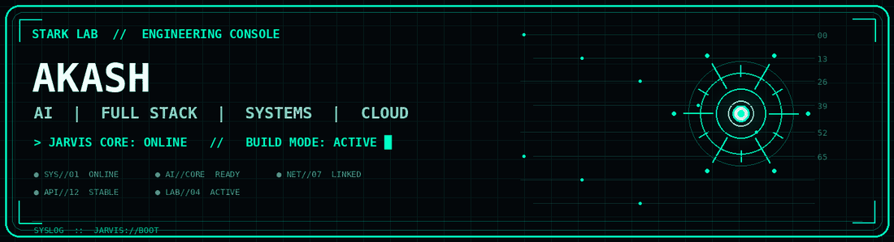


<div align="center">



<br>

# AKASH

### AI | FULL STACK | SYSTEMS | BUILDER

Building intelligent software, production-oriented applications and experimental systems.

<br>

<a href="https://github.com/tejaakashmalla-cmyk">

</a>

<a href="https://tejaakashmalla-cmyk.github.io/portfolio/">

</a>

<br><br>


</div>

---

# JARVIS CORE

```text
+------------------------------------------------------------------+
|                    JARVIS CORE // ONLINE                         |
+------------------------------------------------------------------+
|                                                                  |
|  OPERATOR        AKASH                                           |
|  ROLE            B.Tech IT Engineer                              |
|  PRIMARY         Full-Stack Engineering                          |
|  SECONDARY       AI / Automation / Systems                       |
|  CURRENT MODE    BUILD                                           |
|  STATUS          [ ONLINE ]                                      |
|                                                                  |
|  SYSTEM OBJECTIVE                                                 |
|  Turn ideas into useful software.                                |
|                                                                  |
|  CORE DIRECTIVE                                                   |
|  BUILD -> TEST -> DEPLOY -> OBSERVE -> IMPROVE                    |
|                                                                  |
+------------------------------------------------------------------+